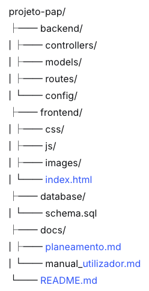

# 🎓 PAP - [Título do Projeto]

## 👤 Informação do Aluno
**Nome:** [Teu Nome Completo]  
**Número:** [Número de Aluno]  
**Curso:** Profissional de Informática - Sistemas
**Ano Letivo:** 2025/2026 
**Orientador:** [Nome do Professor Orientador]

## 📋 Descrição do Projeto
[Descreve brevemente o teu projeto em 2-3 frases. Exemplo:]  
Sistema de gestão de biblioteca online que permite aos utilizadores pesquisar livros, fazer reservas e gerir o seu perfil de leitor.

## 🎯 Objetivos Principais
- [ ] Desenvolver um site dinâmico com base de dados
- [ ] Implementar sistema de autenticação de utilizadores
- [ ] Criar interface responsiva e intuitiva
- [ ] Implementar funcionalidade CRUD completa
- [ ] Fazer deploy da aplicação

## 🛠️ Stack Tecnológica

### **Frontend**
- [ ] HTML5, CSS3, JavaScript
- [ ] Bootstrap/Tailwind CSS [ou outro framework]
- [ ] React/Vue.js [opcional]

### **Backend**
- [ ] Node.js/PHP/Python [escolher um]
- [ ] Express/Laravel/Django [framework]
- [ ] Autenticação JWT/Sessions

### **Base de Dados**
- [ ] MySQL/PostgreSQL
- [ ] ORM: Sequelize/Eloquent [conforme backend]

### **Outras Ferramentas**
- [ ] Git & GitHub
- [ ] Docker [opcional]
- [ ] VSCode

## 📁 Estrutura do Projeto

